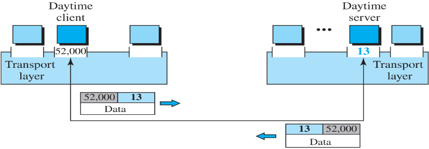

# 컴퓨터네트워크
***

### 9.1   Transport-Layer Services
- 트랜스포트 계층 : 응용층에 서비스 제공
- Process-to-Process
  - Process : 돌아가는 프로그램 (응용층의 객체)
  - entity: 객체 (지구상에 유일하게 구분되는 물체)

- Port Number : 포트번호
  - 통신을 시작하고 요청하는 것 : 클라이언트
  - 통신 요청에 응답 : 서버
  - 클라이언트와 서버의 패러다임이 존재함 (client-server paradigm)

-  Data link - MAC address/HW address/Phy address
-  Network – IP address/Logical address
-  Transport – port number/SAP

- <mark>포트번호는 16bit으로 구성되어있다.</mark>
- <mark>서버는 대부분 well-known (permanent) port numbers</mark>
- <mark>잘 알려져있어야 통신 가능하다.</mark>

#### Socket address

<mark>IP와 포트번호 사이의 연결이 필요하다.</mark>

#### Encapsulation and Decapsulation
응용층 데이터 -> 전송층 데이터 ,  전송층 데이터 -> 응용층 데이터

#### Flow Control
- production과 consumption 사이의 균형
- 너무 빠르게 주면 데이터가 전송 다못함
- 너무 느리게 주면 효율이 안 좋음
- 응용층과 전송층 사이에서 관계 (pushing and pulling)
  - pushing: 보내는 놈이 갑
    - 받는놈이 너무 많이 받으면 흐름제어 요청
    - 응용층 -> 전송층 | 전송층 -> 전송층
  - pulling: 받는놈이 갑
    - 데이터를 달라고 요청하면 보내는 놈이 데이터 전송
    - 응용층 <- 전송층 | 전송층 -> 전송층

#### 오류제어
- 보내는 쪽은 보내기만함
- 받는 쪽에서 오류를 확인함
- 오류제어: 상대방이 제대로 받을때까지
  - 시퀀스 번호 필요
    - 용도: 패킷이 오류가 있는지 응답
  - ACK 필요
    - 용도: 제대로 받았는지 응답
  - 보내는쪽의 타이머
    - 시간이 지나도 응답이 없으면 재전송

#### Sliding window

오류 제어와 흐름 제어를 한번에 해결하기 위한 방법

- window: 보이는 부분
  - size 가 크면 보낼 수 있는 양 증가 (흐름제어)
- 확답을 받을 때까지 window가 오른쪽으로 이동하지 않음(오류제어)

#### 혼잡제어
 네트워크 상의 데이터 처리 

#### connectionless
- 각 각의 패킷이 독립적으로 처리됨
#### connection-oriented
- 패킷이 연결됨
- 연결설정하는 단계가 필요
- 데이터 전송 후 연결을 끊어야됨

***

#### FSM : 파이널 스테이트 머신

#### 오류제어를 위한 3가지 방법론
- Simple Protocol
  - 절대로 존재할수없는 상황
    - 오류 X 흐름문제 X 경우

- Stop-and-Wait Protocol
  - 흐름과 오류 제어
  - 시퀀스 번호, 체크썸 을 붙여 보냄
    - 수신단에서 잘 받았으면 ACK 를 보냄
    - ACK는 ACK넘버와 체크썸으로 구성
  - 작동방식 : 하나를 보내고 ACK가 올때까지 기다림
    - 보내는쪽과 받는쪽의 window size는 1 이다.
  - 약자로 SAW, 시퀀스 번호는 0 ~ 1
  - ACK 번호는 5를 받았으면 6을 보냄

- Go-Back-N Protocol
  - 하나씩 받음
  - 순서가 절대로 뒤바뀔일이 없음
  - 장점: 보내는 쪽의 여유가 있음, 순서
  - 단점: 응답 실패시 다시 N 부터 보냄

- Selective-Repeat Protocol
  - 잘못받은것만 재전송
  - 받은것에 대한 번호로 ACK 번호를 보냄
  - 받은 쪽과 보내는 쪽 windows size가 같다.

- Piggybacking
  - 시퀀스번호와 ack번호를 동사애 보냄
